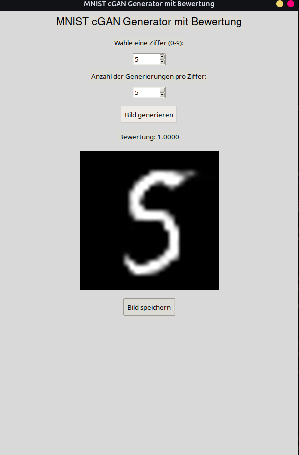
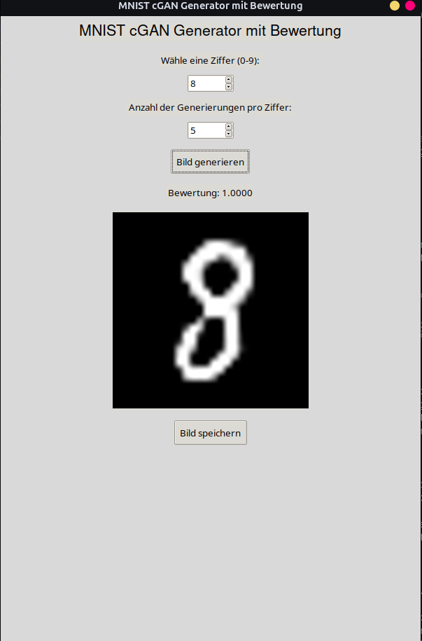

# MNIST cGAN Image Generation and Evaluation System
#### by Luna P. I. Schätzle

## Table of Contents

- [Abstract](#abstract)
- [Introduction](#introduction)
- [Methodology](#methodology)
    - [Conditional Generative Adversarial Networks (cGANs)](#conditional-generative-adversarial-networks-cgans)
        - [Generator Architecture](#generator-architecture)
        - [Discriminator Architecture](#discriminator-architecture)
    - [Evaluation Model: Convolutional Neural Network (CNN)](#evaluation-model-convolutional-neural-network-cnn)
        - [CNN Architecture](#cnn-architecture)
    - [System Integration and GUI](#system-integration-and-gui)
- [System Architecture](#system-architecture)
- [Implementation Details](#implementation-details)
    - [Prerequisites](#prerequisites)
    - [Installation](#installation)
    - [Model Training](#model-training)
        - [Training the cGAN Generator](#1-training-the-cgan-generator)
        - [Training the Evaluation CNN Classifier](#2-training-the-evaluation-cnn-classifier)
    - [Application Structure](#application-structure)
    - [Usage](#usage)
    - [Code Optimization](#code-optimization)
        - [Batch Processing Implementation](#batch-processing-implementation)
        - [Asynchronous Processing with Threads](#asynchronous-processing-with-threads)
- [Results](#results)
- [Conclusion](#conclusion)
- [Future Work](#future-work)
- [References](#references)
- [Acknowledgments](#acknowledgments)
- [Author](#author)
- [License](#license)

## Abstract

This project presents a comprehensive system for generating and evaluating handwritten digit images using Conditional Generative Adversarial Networks (cGANs) and Convolutional Neural Networks (CNNs). Leveraging the MNIST dataset, the system employs a cGAN to synthesize digit images conditioned on specified labels and utilizes a trained CNN classifier to evaluate and select the most accurate representations from multiple generated samples. The integration of these components within a user-friendly Graphical User Interface (GUI) facilitates seamless image generation, evaluation, and management. This document elucidates the methodologies, system architecture, implementation details, and operational guidelines underpinning the project.

## Introduction

Generative Adversarial Networks (GANs) have revolutionized the field of generative modeling by enabling the creation of highly realistic synthetic data. Conditional GANs (cGANs), a variant of GANs, introduce label conditioning, allowing for the generation of data samples corresponding to specific classes. This capability is particularly advantageous in applications requiring controlled data synthesis, such as generating handwritten digits for educational purposes or augmenting datasets for machine learning tasks.

The MNIST dataset, comprising 70,000 grayscale images of handwritten digits (0-9), serves as an ideal benchmark for evaluating generative models due to its simplicity and widespread use. In this project, a cGAN is trained on the MNIST dataset to generate synthetic digit images conditioned on user-specified labels. To ensure the quality and accuracy of the generated images, a separate CNN classifier is trained to evaluate and select the best-performing images from multiple generations. The entire pipeline is encapsulated within a GUI, providing an accessible interface for users to generate, evaluate, and manage digit images.

## Methodology

### Conditional Generative Adversarial Networks (cGANs)

A cGAN comprises two neural networks: a generator and a discriminator, trained simultaneously through adversarial processes. The generator synthesizes images conditioned on input labels, while the discriminator evaluates the authenticity of the generated images against real samples. The conditioning mechanism in cGANs facilitates the generation of class-specific images, enhancing the controllability and relevance of the output.

#### Generator Architecture

The generator network takes a noise vector and a one-hot encoded label as inputs. The noise vector introduces stochasticity, enabling the generation of diverse images, while the label ensures the output corresponds to the desired digit class. The architecture typically consists of dense layers followed by transposed convolutional layers to upscale the input into a high-resolution image.

#### Discriminator Architecture

The discriminator network receives an image and its corresponding label as inputs. It outputs a probability indicating whether the image is real or synthetic. The discriminator employs convolutional layers to extract hierarchical features, facilitating accurate discrimination between real and generated images.

### Evaluation Model: Convolutional Neural Network (CNN)

To assess the quality of generated images, a CNN classifier is trained on the MNIST dataset. This classifier evaluates the generated images by predicting their digit labels and assigning confidence scores. By generating multiple samples and selecting the image with the highest confidence score, the system ensures the selection of the most accurate and realistic digit representation.

#### CNN Architecture

The CNN classifier comprises multiple convolutional and pooling layers, followed by fully connected layers. The architecture is optimized for high accuracy in digit classification, making it suitable for evaluating the fidelity of generated images.

### System Integration and GUI

The system integrates the cGAN generator and CNN evaluator within a Tkinter-based GUI. Users can specify the desired digit, generate multiple image samples, and visualize the highest-scoring image based on the evaluator's assessment. The GUI also provides functionalities for saving generated images, enhancing usability and accessibility.

## System Architecture


1. **Data Input:** User selects the digit label via the GUI.
2. **Image Generation:** The cGAN generator produces multiple digit images conditioned on the selected label.
3. **Image Evaluation:** The CNN classifier evaluates each generated image, assigning confidence scores.
4. **Image Selection:** The system selects the image with the highest confidence score.
5. **User Interaction:** The selected image is displayed in the GUI, with options to save the image.

## Implementation Details

### Prerequisites

- Python 3.7+
- TensorFlow 2.x
- Keras
- NumPy
- Pillow
- Tkinter

### Installation

1. **Clone the Repository**

   ```bash
   git clone https://github.com/yourusername/mnist-cgan-evaluation.git
   cd mnist-cgan-evaluation
   ```

2. **Create a Virtual Environment**

   ```bash
   python -m venv venv
   source venv/bin/activate  # On Windows: venv\Scripts\activate
   ```

3. **Install Dependencies**

   ```bash
   pip install -r requirements.txt
   ```

### Model Training

#### 1. Training the cGAN Generator

Ensure the cGAN generator is trained on the MNIST dataset. The training script should define the generator and discriminator architectures, compile the models, and execute the adversarial training loop. After training, save the generator model for subsequent use.

```bash
python train-cgan.py
```

#### 2. Training the Evaluation CNN Classifier

Train the CNN classifier on the MNIST dataset to evaluate the generated images.

```bash
python train-evaluation-model.py
```

This script loads the MNIST dataset, preprocesses the data, defines the CNN architecture, trains the model, and saves the trained classifier.

### Application Structure

- `generator_cgan-numbers.h5`: Pre-trained cGAN generator model.
- `evaluation_model.h5`: Trained CNN classifier for image evaluation.
- `cgan-gui-xx.py`: Main application script. Replace `xx` with your preferred version.
- `train_cgan.py`: Script for training the cGAN generator.
- `train_evaluation_model.py`: Script for training the CNN classifier.
- `requirements.txt`: List of Python dependencies.

### Usage

1. **Ensure Dependencies are Installed**

   ```bash
   pip install -r requirements.txt
   ```

2. **Train the Models**

   - Train the cGAN generator using `train_cgan.py`.
   - Train the CNN classifier for image evaluation using `train_evaluation_model.py`.

3. **Launch the Application**

   ```bash
   python cgan-gui-xx.py
   ```

4. **GUI Operations**

   - **Select Digit:** Use the spinbox to choose a digit (0-9) for image generation.
   - **Specify Number of Generations:** Define how many images to generate per digit.
   - **Generate Image:** Click the "Bild generieren" button to generate and evaluate images.
   - **View Evaluation Score:** The system displays the confidence score of the selected image.
   - **Save Image:** Click the "Bild speichern" button to save the generated image locally.

### Code Optimization

The application employs batch processing for image generation and evaluation, significantly enhancing performance by reducing the computational overhead associated with individual image evaluations. Additionally, asynchronous processing via threading ensures that the GUI remains responsive during intensive computation tasks, providing a seamless user experience.

#### Batch Processing Implementation

The `generate_image` function is optimized to generate and evaluate images in batches, leveraging vectorized operations to expedite processing.

```python
def generate_image(generator, digit, evaluator, noise_dim=100, num_generations=5):
    # Batch generation and evaluation logic
    ...
```

#### Asynchronous Processing with Threads

The GUI operations responsible for image generation and evaluation are executed in separate threads, preventing the main thread from blocking and maintaining interface responsiveness.

```python
import threading

class CGANApp:
    ...
    def display_generated_image(self):
        # Launch image generation in a separate thread
        thread = threading.Thread(target=self.generate_and_display, args=(digit, num_generations))
        thread.start()
    ...
```

## Results

Upon executing the application, users can generate multiple instances of handwritten digits corresponding to the selected label. The CNN evaluator assesses each generated image, and the system displays the image with the highest confidence score, ensuring high-quality outputs. Below are sample outcomes:


*Figure 1: Generated image of digit '5' with the highest evaluation score.*


*Figure 2: Generated image of digit '8' with the highest evaluation score.*

## Conclusion

This project successfully integrates a Conditional Generative Adversarial Network with a Convolutional Neural Network classifier to generate and evaluate handwritten digit images. The system's architecture ensures the generation of high-fidelity images, while the evaluation mechanism guarantees the selection of the most accurate representations. The user-centric GUI facilitates easy interaction, making the technology accessible to a broader audience. Future enhancements may include extending the system to support additional datasets, incorporating more sophisticated evaluation metrics, and deploying the application as a web-based tool for enhanced accessibility.

## Future Work

- **Extended Dataset Support:** Incorporate additional datasets beyond MNIST, such as Fashion-MNIST or CIFAR-10, to broaden the applicability of the system.
- **Enhanced Evaluation Metrics:** Integrate more nuanced evaluation metrics, including perceptual similarity measures and adversarial robustness assessments.
- **Web-Based Interface:** Develop a web-based version of the application to facilitate remote access and broader user engagement.
- **Real-Time Training Feedback:** Implement real-time monitoring and visualization tools for the training processes of both the cGAN and CNN models.
- **User Customization:** Allow users to fine-tune generator parameters, such as noise dimensions and layer configurations, to experiment with different generation dynamics.

## References

1. Goodfellow, I., Pouget-Abadie, J., Mirza, M., Xu, B., Warde-Farley, D., Ozair, S., ... & Bengio, Y. (2014). **Generative adversarial nets**. *Advances in neural information processing systems*, 27.
2. Mirza, M., & Osindero, S. (2014). **Conditional generative adversarial nets**. arXiv preprint arXiv:1411.1784.
3. LeCun, Y., Bottou, L., Bengio, Y., & Haffner, P. (1998). **Gradient-based learning applied to document recognition**. *Proceedings of the IEEE*, 86(11), 2278-2324.
4. Chollet, F. (2017). **Deep learning with Python**. Manning Publications.

## Acknowledgments

We extend our gratitude to the contributors of the TensorFlow and Keras libraries, which provided the foundational tools necessary for developing and training the neural networks employed in this project. Additionally, we acknowledge the creators of the MNIST dataset for their invaluable contribution to the field of machine learning.

## Author

Luna Priska Ingrid Schätzle
- GitHub: [Luna-Schaetzle](https://github.com/Luna-Schaetzle)
- Email: luna.schaetzle@gmail.com
- Website: [luna-schaetzle.xyz](https://luna-schaetzle.xyz)
- LinkedIn: [Luna Schätzle](https://at.linkedin.com/in/luna-sch%C3%A4tzle-762a09303)


## License

This project is licensed under the [GNU General Public License v3.0](https://www.gnu.org/licenses/gpl-3.0.en.html). For more details, refer to the `LICENSE` file in the project repository.